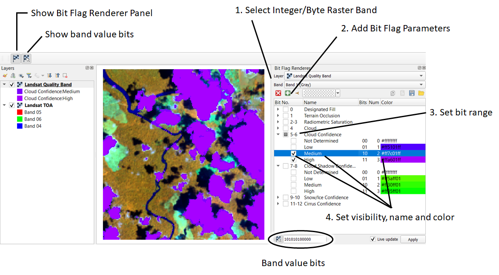

# README

The Bit Flag Renderer is a [QGIS](https://www.qgis.org) plugin to visualize quality bit images.

Please visit https://bit-flag-renderer.readthedocs.io/en/latest for more information.

Licence and Use
---------------

The Bit Flag Renderer is licenced under the [GPL-3 Licence](GPL-3.0.txt).
