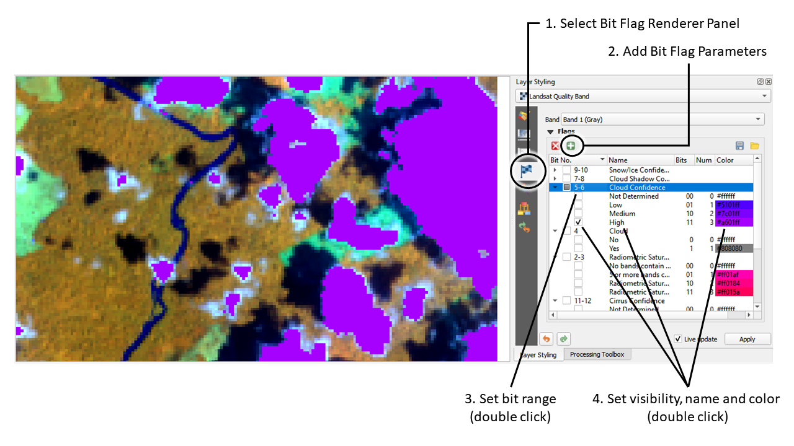

.. DEFINE ICONS AND IMAGE HERE

============
How to Use
============

To visualize selected bit flags of a byte/integer raster layer that is already opened in QGIS, open the Layer Styling Panel and:

   Clouds and shadows according to the Landsat quality assessment (QA) flag layer, visualized with the Bit Flag Renderer panel

1. Select the Bit Flag Renderer panel
2. Add the number of Bit Flag parameter you like to show

3. Define for each parameter the bit positions and number of different states it is defined for, e.g.

    - '0' for the first bit = 2 flag states
    - '1' for the second bit = 2 flag states
    - '1-2' for bit 1 and 2 = 2^2 = 4 flag states
    - '1-3' for bit 1, 2 and 3 = 2^3 = 8 flag states

Now control the visibility of flag states in the map and layer legend:

* Change flag state visibility by checking/unchecking them in the tree view
* Define names of parameters and flag state (double click)
* Define flag state colors (double click)
