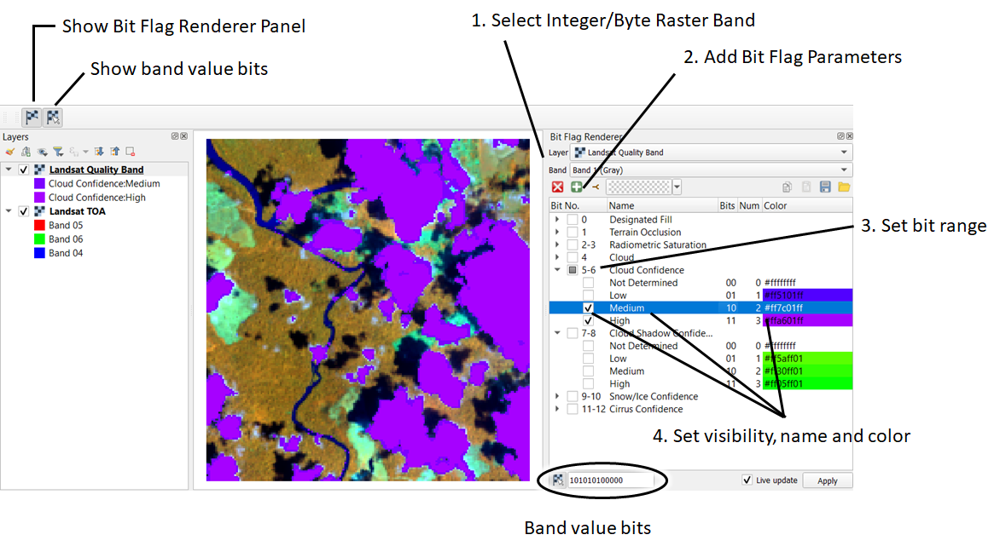

.. DEFINE ICONS AND IMAGE HERE

How to Use
==========

   Clouds and shadows according to the Landsat quality assessment (QA) flag layer, visualized with the Bit Flag Renderer panel

To visualize bit flags of a byte/integer raster layer, select this layer in the QGIS raster layer tree and
open the QGIS Layer Styling Panel. Then:

1. Select the Bit Flag Renderer sub panel

2. Add the number of Bit Flag parameter that you like to show or open load a pre-defined scheme of bit flags

3. Specify for each parameter (double click) the first bit position and the total number of bit the parameter is using. The total number of bits
   controls the number of possible states a parameter can have per pixel, e.g.

    - '0' for the first bit = 2 flag states
    - '1' for the second bit = 2 flag states
    - '1-2' for bit 1 and 2 = 2^2 = 4 flag states
    - '1-3' for bit 1, 2 and 3 = 2^3 = 8 flag states

Now control the visibility of flag states in the map and layer legend:

* Change flag state visibility by checking/unchecking them in the tree view
* Define names of parameters and flag state (double click)
* Define flag state colors (double click)
